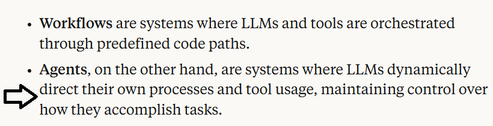
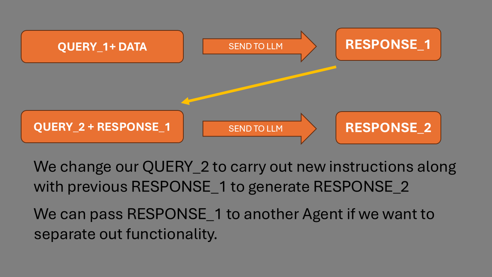
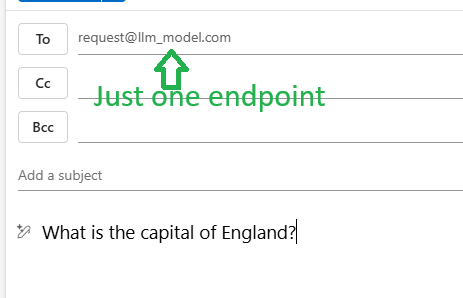
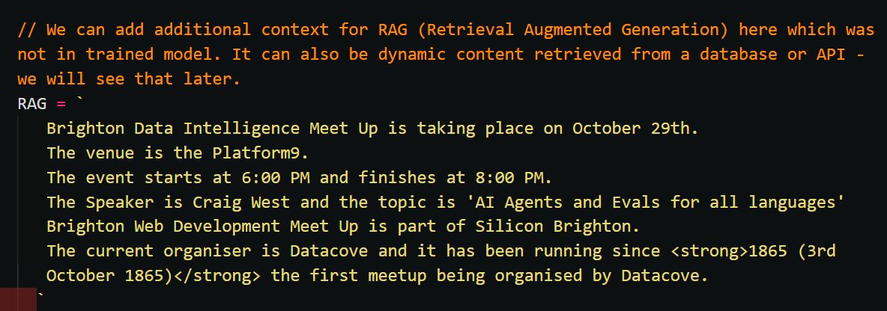
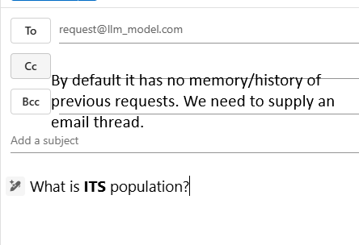
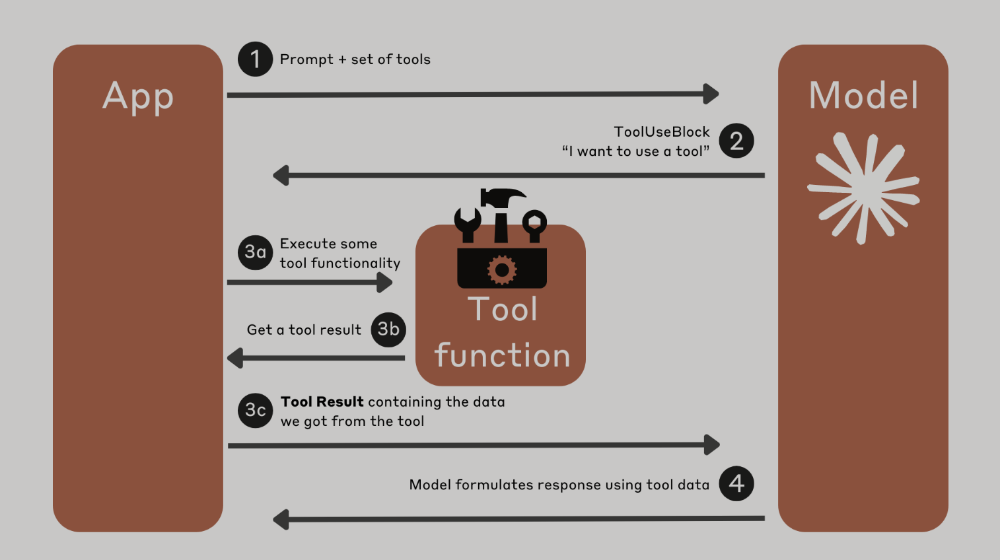
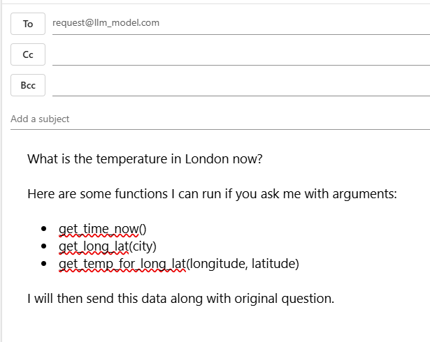

<!-- https://mconverter.eu/convert/markdown/html/ -->

# GitHub Repo

[https://github.com/Python-Test-Engineer/brighton-data-intelligence-may-2026](https://github.com/Python-Test-Engineer/brighton-data-intelligence-may-2026)

## Aim

1. To see that it can be just 'AI as API', albeit a very magical API.
2. To show that AI based apps need not be all AI or not at all, but we can have 'a bit of AI in our apps'.
3. To show that it is 'business as usual' as Data Intelliegence, using our experience and skills to create AI Apps for Data Intelligence.

Finally, we will look at an example Data Intelligence Agent.

<h3 style="color:#DB4C00;">
 Let's look at where Agentic Data Engineering differ from regular Data Engineering perhaps we may see that AI Agents are everyday Python with LLM API calls.
</h3>

## Who am I?

**I am one of *US* - a Data Engineer.** (I will use Data Engineer as a catch all description).

Wrestling and getting to grips with these new technologies.

*"It doesn't get any easier - just different." - Anon*

I was in tech in the early 2000s as a Business Information Architect and Certified MicroSoft SQL Server DBA, having been an accountant in the 1990s. I returned in 2017 via WordPress and JavaScript Frameworks, moving to Python and ML in 2021.

Website: [https://craigwestai.com/](https://craigwestai.com/)

### Leo and Pip

We have a local red fox that is apt to follow us...

### My first computer 1979

!

<https://en.wikipedia.org/wiki/Punched_tape#/media/File:Creed_model_6S-2_paper_tape_reader.jpg>

...cut and paste was cut and paste!

# What are AI Agents?

There are many definitions:

## Anthropic

Very good article [https://www.anthropic.com/research/building-effective-agents](https://www.anthropic.com/research/building-effective-agents)

## Demystify and simplify

What I would like to achieve in this talk is to **demystify** and **simplify** AI Agents and AI Programming because it can seem like it is another different world of dev.

What if AI Agents were 'just' code with a REST API call, admittedly a very magical API?

*AI (Agents) as API*...

Then, we would use day to day software design patterns to handle the responses we get back from the AI Agent and move on to the next step.

Business as usual for developers.

This is the main focus of the talk - **demystify and simplify** - and this will enable you to create AI Agents and also construct workflows using AI Agents.

With that in mind, we don't need to fully grasp the python code this time around but focus on the 'AI bit' which I will highlight.

It is more about seeing the high level view and one can dig deeper into the code offline.

*Look at the patterns and structure rather than the code details* - it is what helped me get to grips with this new paradigm.

## 180 degrees

I like to use the metaphor of the upside down computer mouse. When we try to use it, it can take while to reverse our apporach. It is still the same set of movements - left, right, up and down - but in the opposite way to the way we are used to.

There are 3 areas concerning Agentic AI in my opinion:

1. Client side creation of endpoints (APIs) rather than server side prebuilt endpoints.
2. Use of Natural/Human Language, in my case English to create the code.
3. Autonomy - the LLM directs the flow of the app.

For the purpose of this talk I will use the term `function` in the mathematical sense:

### input -> function(input) -> output -> function(output) -> output2

The function might be a variation on the Agent we are using or it may be another Agent that accepts the opuput as input. No different to Python Classes/Functions in an App.

The `function` might be a function or a class.

This is a very simple example of a REST API.

Again, this is to demystify and simplify any libraries we may import for convenience functions.

input -> function(input) -> output -> function(output) -> output2

We generate a response with our first query using a system prompt to create code.

We then pass the output into another function that acts as a reviewer to produce the next version of the code.

## HISTORY - LOOPING - CONTEXT

These are three core principles that create powerful agents.

### History

Providing previous exchanges to enable agents to have memeory as they are at core stateless.

### Looping

Repeating Q/A until model feels it has a final answer.

### Context

Providing the required information either statically or dynamically.

## Let's use Email as an analogy

