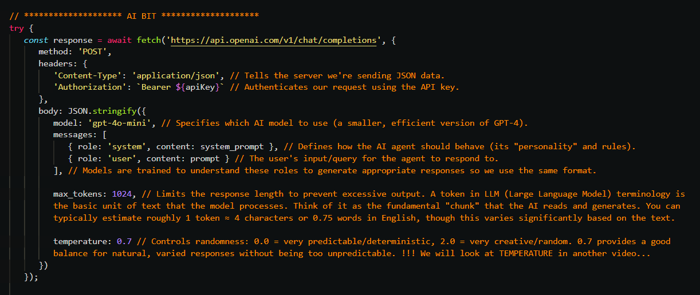

<!-- https://mconverter.eu/convert/markdown/html/ -->

# GitHub Repo

[https://github.com/Python-Test-Engineer/brighton-data-intelligence-may-2026](https://github.com/Python-Test-Engineer/brighton-data-intelligence-may-2026)

    

## Aim

1. To see what an AI Agent is at its most basic implementation

2. Understand the concepts of MEMORY-CONTEXT-LOOPING-TOOl_CALLING as the building blocks of AI Agents.

3. See how these building blocks help us build coding/executive_assistants and finally a Data Intelligence Agent (APP).
s

    

## Who am I?

**I am one of *US* - a Data /Agentic Engibneersfsd.** (I will use Data Engineer as a catch all description).

Wrestling and getting to grips with these new technologies.

*"It doesn't get any easier - just different." - Anon*

I was in tech in the early 2000s as a Business Information Architect and Certified MicroSoft SQL Server DBA, having been an accountant in the 1990s. I returned in 2017 via WordPress and JavaScript Frameworks, moving to Python and ML in 2021.

Website: [https://craigwestai.com/](https://craigwestai.com/)

### Leo and 

Fox red labrador (Leo) and Cockapoo (Pip)

We have a local red fox that is apt to follow us...

### My first computer 1979

<https://en.wikipedia.org/wiki/Punched_tape#/media/File:Creed_model_6S-2_paper_tape_reader.jpg>

...cut and paste was cut and paste!

    

# What are AI Agents?

There are many definitions and it does not really matter:

## Anthropic

Very good article [https://www.anthropic.com/research/building-effective-agents](https://www.anthropic.com/research/building-effective-agents)

    

## Demystify and simplify

What I would like to achieve in this talk is to **demystify** and **simplify** AI Agents because it can seem like it is another different world.

What if AI Agents were 'just' code with a REST API call, admittedly a very magical API?

*AI (Agents) as API*...

This snippet of code is the most important takeway tonight...to be explained

We can tghen create the HARNESS around this.
Business as usual.

This is the main focus of the talk - **demystify and simplify** - and this will enable you to create AI Agents and also construct workflows using AI Agents.

Inititally, will use the analogy of email to help us see agents in a non-technical way.

*Look at the patterns and structure rather than the code details* - it is what helped me get to grips with this new paradigm.

    

## 180 degrees

I like to use the metaphor of the upside down computer mouse. When we try to use it, it can take while to reverse our apporach. It is still the same set of movements - left, right, up and down - but in the opposite way to the way we are used to.

## Let's use Email as an analogy

 

### We can add context and this is 'In Context Learning'. It can also be derived programatically.

    

## Email as an analogy

## HISTORY/MEMORY - TOOLS/FUNCTIONS - LOOPING

    

There are 3 areas concerning Agentic AI in my opinion:

1. Client side creation of endpoints (APIs) rather than server side prebuilt endpoints.
2. Use of Natural/Human Language, in my case English to create the code.
3. Autonomy - the LLM directs the flow of the app.

For the purpose of this talk I will use the term `function` in the mathematical sense:

### input -> function(input) -> output -> function(output) -> output2

The function might be a variation on the Agent we are using or it may be another Agent that accepts the output as input. No different to  Classes/Functions in an App.

The `function` might be a function or a class.

This is a very simple example of a REST API.

Again, this is to demystify and simplify any libraries we may import for convenience functions.

input -> function(input) -> output -> function(output) -> output2

We generate a response with our first query using a system prompt to create code.

We then pass the output into another function that acts as a reviewer to produce the next version of the code.

G

    

## HISTORY - LOOPING - CONTEXT - TOOLS

These are three core principles that create powerful agents.

### History

Providing previous exchanges to enable agents to have memeory as they are at core stateless.

### Looping

Repeating Q/A until model feels it has a final answer.

### Context

Providing the required information either statically or dynamically.

### Tools

These are run-time functions that do things or get more context.

    

## HTML examples

With JavaScript to use an API request (POST), we can see examples of these.

(In repo there is `why_temp_equal_zero_not_deterministic.md` that explains this).

Let's look at some HTML examples in `HTML-PAGES` folder...

(In LINKS.md there are links to explainer videos etc as well as the folder `HTML-EXPLAINERS`).

    

## Coding agents

With the following tools, one can create one's own coding agent. LINKS.md has links to articles, videos and my mini-claude repoand others in `LINKS.md` to create your own:

- list files
- read a file
- edit a file
- write a file
- bash

In fact, `bash` is the only tool you need.

## PROMPT ENGINEERING => CONTEXT ENGINEERING => HARNESS ENGINEERING

    

## Data Intelligence Agent

Let's look at an example that:

- given a CSV (no data card)
- does ETL
- create 40+ questions of an SQL nature
- creates the SQL statement for these, runs them and saves the answer as part of the knowledge base
- save OBJECTIVE questions that a user may want answering
- creates all the plots and charts
- use AI to analase each image for useful information
- summarise all of these in one document
- answers the OBJECTIVES
- has a 'ASK AI' section to answer questions based on the SQL and chart analyses
- uses another AI to be ADVERSARIAL and critique the original analysis

The repo for this is in `LINKS.md`