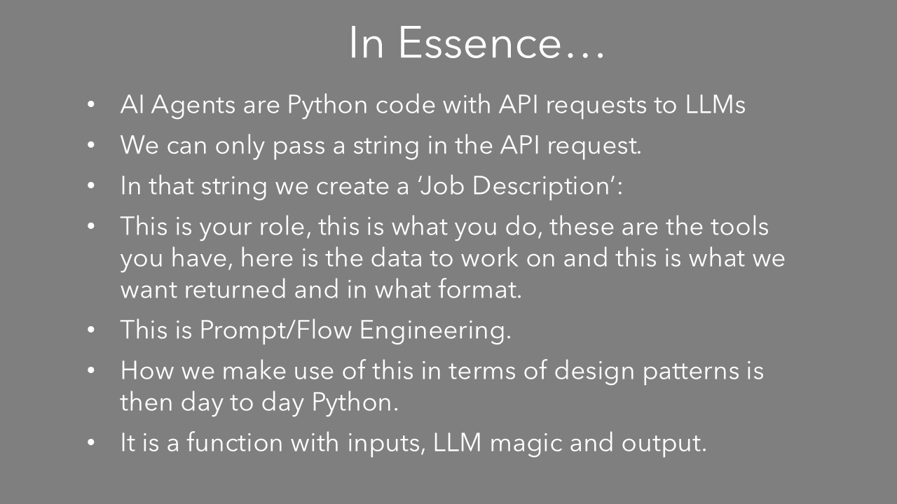
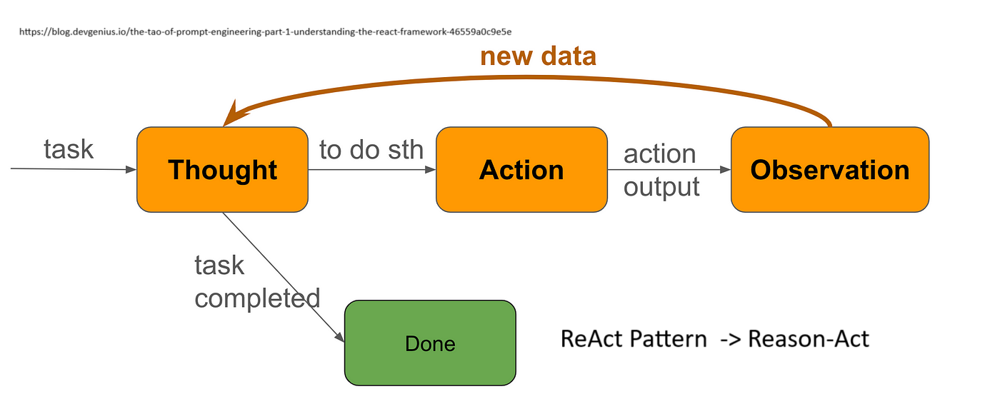

<!-- https://mconverter.eu/convert/markdown/html/ -->

# GitHub Repo

[https://github.com/Python-Test-Engineer/brighton-data-intelligence-may-2026](https://github.com/Python-Test-Engineer/brighton-data-intelligence-may-2026)


## Aim

1. To see that it can be just 'AI as API', albeit a very magical API.
2. To show that AI based apps need not be all AI or not at all, but we can have 'a bit of AI in our apps'.
3. To show that it is 'business as usual' as Data Intelliegence, using our experience and skills to create AI Apps.


<h3 style="color:#DB4C00;">
 Let's look at where Agentic Data Engineering differ from regular Data Engineering perhaps we may see that AI Agents are everyday Python with LLM API calls.
</h3>

## Who am I?

**I am one of *US* - a regular Pythonista.**

Wrestling and getting to grips with these new technologies.

*"It doesn't get any easier - just different." - Anon*

I was in tech in the early 2000s as a Business Information Architect and Certified MicroSoft SQL Server DBA. I returned in 2017 via WordPress and JavaScript Frameworks, moving to Python and ML in 2021.

Currently, I am working on a project 'AI Powered Knowledge Systems', building a book/framework similiar to PyTest Full Stack.

Website: [https://craigwestai.com/](https://craigwestai.com/)

### Leo and Pip

Just got a Red Fox Labrador Pup Leo, (much earlier than planned):


We have a local red fox that is apt to follow us...


...even to our home...


### My first computer 1979

!

<https://en.wikipedia.org/wiki/Punched_tape#/media/File:Creed_model_6S-2_paper_tape_reader.jpg>

...cut and paste was cut and paste!


# What are AI Agents?

There are many definitions:

## Anthropic


Very good article [https://www.anthropic.com/research/building-effective-agents](https://www.anthropic.com/research/building-effective-agents)

## HuggingFace


## Pydantic


We will look at examples of code to see what AI Agents are and what they can do.

If we look at:

## [https://aiagentsdirectory.com/landscape](https://aiagentsdirectory.com/landscape)

We can see that there are many examples of AI Agent Frameworks and they seem to increase each week.

At the beginning of the year it was in the 700s.

## Demystify and simplify

What I would like to achieve in this talk is to **demystify** and **simplify** AI Agents and AI Programming because it can seem like it is another different world of dev.

What if AI Agents were 'just' Python code with a REST API call, admittedly a very magical API?

*AI (Agents) as API*...

Then, we would use day to day Python design patterns to handle the responses we get back from the AI Agent and move on to the next step.

Business as usual for Python developers.

This is the main focus of the talk - **demystify and simplify** - and this will enable you to create AI Agents and also construct workflows using AI Agents.

With that in mind, we don't need to fully grasp the python code this time around but focus on the 'AI bit' which I will highlight.

It is more about seeing the high level view and one can dig deeper into the code offline.

The repo is built as if a mini workshop with notebooks and `.py` files heavily commented.

*Look at the patterns and structure rather than the code details* - it is what helped me get to grips with this new paradigm.

We will use Notebooks to explore AI Agents and then we will see an implementation of an AI Agent in a py file that combines many of the concepts we will discuss.

## 180 degrees


I like to use the metaphor of the upside down computer mouse. When we try to use it, it can take while to reverse our apporach. It is still the same set of movements - left, right, up and down - but in the opposite way to the way we are used to.

There are 3 areas concerning Agentic AI in my opinion:

1. Client side creation of endpoints (APIs) rather than server side prebuilt endpoints.
2. Use of Natural/Human Language, in my case English to create the code.
3. Autonomy - the LLM directs the flow of the app.

For the purpose of this talk I will use the term `function` in the mathematical sense:

### input -> function(input) -> output -> function(output) -> output2

The function might be a variation on the Agent we are using or it may be another Agent that accepts the opuput as input. No different to Python Classes/Functions in an App.


The `function` might be a Python function or a class.

This is a very simple example of a REST API.

Again, this is to demystify and simplify any libraries we may import for convenience functions.

Authentication takes place by passing some sort of token to the server, usually in the headers:

```
model = "gpt-3.5-turbo"
model_endpoint = "https://api.openai.com/v1/chat/completions"

## There is no reference to previous requests to maintain a history - we must supply the history with each request.

headers = {
    "Content-Type": "application/json",
    "Authorization": f"Bearer {api_key}",
}

# payload may vary from LLM Organisation but it is a text string.
payload = {
   "model": model,
   "messages": [
       {"role": "system", "content": system_prompt},
       {"role": "user", "content": user_prompt},
   ],
   "stream": False, # we can stream response
   "temperature": temperature, # degree of variation with randomness
}

Low Temperature:

https://medium.com/@jpraveenkanna/demystifying-llm-configurations-for-inference-3866979806de

The bag is full of mostly blue marbles, with a few red and green. Low temperature means you're very likely to pull a blue marble, but you might occasionally get a red or green.

High Temperature:
The bag is filled with a mix of colors, and all colors are equally likely. High temperature means you're equally likely to pull any color, including the less common ones.
# Use HTTP POST method
response = requests.post(
   url=model_endpoint, # The endpoint we are sending the request to. Low Temperature:
The bag is full of mostly blue marbles, with a few red and green. Low temperature means you're very likely to pull a blue marble, but you might occasionally get a red or green.
High Temperature:
The bag is filled with a mix of colors, and all colors are equally likely. High temperature means you're equally likely to pull any color, including the less common ones.t, # The API
   headers=headers, # Headers for authentication etc
   data=json.dumps(payload) # The request data we are sending
).json()

# KEY TAKEAWAYs

## There is only one endpoint. We don't use other endpoints for differing tasks, there is just one end point and we will create our custom endpoint through prompt engineering.

The request is text and does not contain any objects or other data types.

Likewise, we get a text response. We pass some text to a function and get some text back.

```

We can think of it as pseudo-code which we may write whilst developing an app.

In fact, it is like a person starting a new job. They will get a handbook of what the job involves, how to do it etc. and this is what we are doing with the LLM. 




input -> function(input) -> output -> function(output) -> output2

We generate a response with our first query using a system prompt to create code.

We then pass the output into another function that acts as a reviewer to produce the next version of the code.

